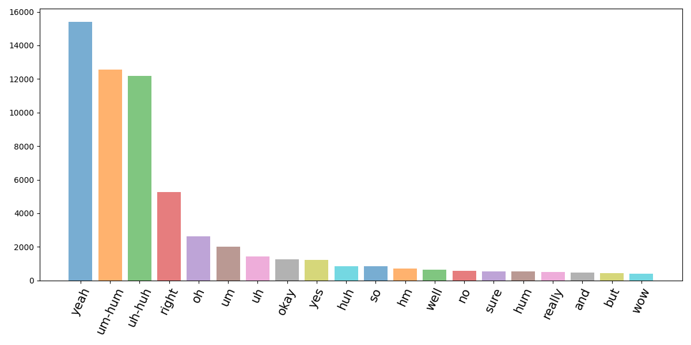
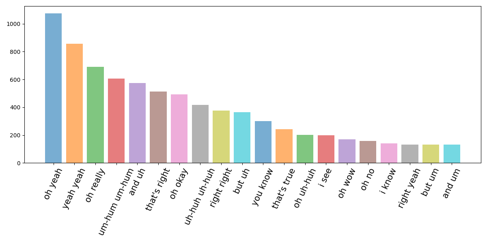

# Switchboard


Configs
* `Raw`
  - Don't process the dataset or chunk it into sequences
  - Use the raw annotations (see annotation guide below)
* `Default`
  - Apply swb-specific regexp to "clean" the annotation style to text
* `Classification`
  - Use the data from `Default` but extract ['shift', 'hold', 'bachchannel'] segments (including history)


Example of use
```python

# path to `switchboard.py` script
DATASET_SCRIPT = join(repo_root(), "datasets_turntaking/dataset/switchboard/switchboard.py")

dataset = load_dataset(
    DATASET_SCRIPT,
    split="train",
    name="default",
)
```

----------------------------------------------------

## Cleaning
#### Annotation guide

see [guide](https://www.isip.piconepress.com/projects/switchboard/doc/transcription_guidelines/transcription_guidelines.pdf) for annotation references.

Backchannels
* `20. Hesitation sound: "ah", "uh" (vowel sound) and "um", "hm" (nasal sound)`
* `21. Yes/no sound: Use "uh-huh" or "um-hum" (yes) and "huh-uh" or "hum-um" (no)`

#### Processing

These processing steps are performed for configs with `clean` e.g. `strict_time_clean`. See `datasets_turntaking/dataset/switchboard/utils.py`.
- Noise
  - remove noise
  - `[noise]`
  - `[vocalized-noise]`
- laughter (clean)
  - `[laughter]`: refers to "clean" laughter. No words spoken during laugh.
- Laughter + word
  - `[laughter-{word}]`: refers to laughter while saying `{word}` i.e. `[laughter-hi]`
  - Changed to the spoken word: `[laughter-hi]` -> `hi`
- Restarts
  - `{word}-`: refers to restarts.
  - example: `i- i really felt` or `i['m]-`
  - remove hyphen: `i-` -> `i`
- Coinage, using a word that is not an actual word.
  - example: `{weatherwise}` 
  - simply remove `{}`
- Mispronounciation
  - we keep only the correct word
  - example: `[splace/space]` -> `space`
- Partial words
  - we keep the complete word
  - example 1: 
    - persons says only "w" in "went"
    - `w[ent]` -> `went`
  - example 2: 
    - persons says only "at" in "that"
    - `-[th]at` -> `that`
- Pronounciation variants
  - use the written word
  - example: `about_1`, `okay_1`, etc  `okay_1 = mkay`
    - `okay_1` -> `okay`
- Asides, or speaking to someone else not related to the dialog
  - `<b_aside>` and `<e_aside>` represents the beginning and end, respectively, of such an occasion.
  - Unclear how to use this cleanly.
  - 98 files include these annotations and we omit these.


## Analysis



The top 20 **one-word-utterances** in switchboard `time_strict_clean`. The top 5 **one-word-utterances** constitutes 75% of all **one-word-utterances** that occurs over 1 time.


The top 20 **two-word-utterances** in switchboard `time_strict_clean`. The top 5 **two-word-utterances** constitutes 25% of all **two-word-utterances** that occurs over 1 time.

#### Backchannels

The chosen backchannels for the IPU-dataset is given by the top5 most common
**one-word-utterances** and the **two-word-utterances** that are similar to
those in top5 one-word. See list below:

```
backchannels = [
    "yeah", 
    "um-hum", 
    "uh-huh", 
    "right", 
    "oh",
    "oh yeah",
    "yeah yeah",
    "right right",
    "oh really",
    "um-hum um-hum",
    "uh-huh uh-huh",
    "oh uh-huh"
]
```
